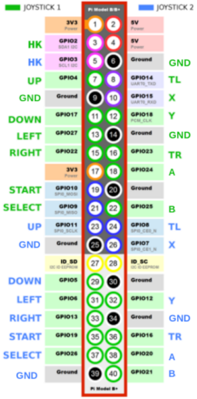

<h1 align="center">
  
  <br>
</h1>

<h4 align="center">
Arcade DT: Portable Game Controller- / Joystick-Driver in 100% Device Tree Source
</h4>
<p align="center" style="">
For (Retro-)Gamers on the Raspberry Pi:<br>
Precise game control due to close to zero input lag<br>
No C-code and building, only essential driver configuration<br>
Always up-to-date with the Kernel<br>
Utilizes on-board GPIO: No indirection via USB needed<br>
Ready for SBC other than the Raspberry Pi
</p>

<p align="center">
  <a href="#prerequisites">Prerequisites</a> •
  <a href="#install-on-raspberry-pi">Installation</a> •
  <a href="#configuration">Configuration</a> •
  <a href="#wiring">Wiring</a> •
  <a href="#showtime">Showtime!</a> •
  <a href="#how-do-i--">How do I ...?</a> •
  <a href="#troubleshooting">Troubleshooting</a> •
  <a href="#references">References</a>
</p>

---

Arcade DT lets you connect any joystick with momentary switches to GPIO and makes it available as event input device (evdev). It utilizes the device tree to define a joystick input device at the GPIO pins.

The joystick driver is defined as device tree source ("configuration-as-code"). You can drive up to two joysticks with two-axis and nine buttons (2 x 13 "buttons" in total) or if you use port expanders (Microchip's MCP23017) you can drive up to eight joysticks with up to 16 buttons each.

Arcade DT makes the use of an USB based encoder obsolete and also saves you possible input-lag introduced by the indirection via USB. Additionally the joystick events are efficiently processed by the Kernel: The events are generated by interrupts, thus no polling eats up precious cycle time. The design of Arcade DT means also there no need for additional userland solutions like gpionext.

This project is a state-of-the-art replacement for the C-codebase kernel module implementations of `mk_arcade_joystick_rpi` and `db9_gpio_rpi`.

Arcade DT is highly customizable and should be easily portable to other single board computers that also use the device tree to define hardware capabilities.

## Prerequisites

- An Arcade Controller Board or a joystick/gamepad with up to 13 buttons (momentary switches), you can even use joysticks with less buttons, like a Competition Pro joystick or an Atari joystick
- A Raspberry Pi with a 40-pin GPIO header
- If you want to drive more than 13 buttons or more than two joysticks: Microchip 23017 port expanders
- Linux on the Raspberry Pi, in minimum Kernel 4.19 onwards

## Install on Raspberry Pi

One time setup:

1. Clone this repository to your Raspberry Pi: `git clone --depth 1 https://github.com/Gemba/arcade-dt`
1. Navigate into the repository: `cd arcade-dt`
1. Install `ovmerge`: `wget https://raw.githubusercontent.com/raspberrypi/utils/refs/heads/master/ovmerge/ovmerge && chmod a+x ovmerge`
1. Install/check if you have these buildtools: `sudo apt install cpp device-tree-compiler make`
1. Install the kernel headers matching your kernel: You have two options.
   - Either use the prepared [debian packages](https://www.raspberrypi.com/documentation/computers/linux_kernel.html#kernel-headers). If you are unsure which package to install run `uname -r` and check the suffix (e.g., `-rpi-v7l`) after the kernel version numbers. One of these commands should fit:
     ```bash
     sudo apt install linux-headers-rpi-v8
     sudo apt install linux-headers-rpi-v7l
     sudo apt install linux-headers-rpi-v7
     sudo apt install linux-headers-rpi-v6
     ```
   - If _none_ of these packages is available you can run `sudo apt install linux-headers-rpi` as fallback.
   - Afterwards you should have some folder named `linux-headers-*-common*` below `/usr/src`. Don't worry: The foldername does not have to be the same as the minor and micro kernel version you are running. It's purpose is only to provide the defines for the evdev event codes e.g., `#define BTN_DPAD_UP 0x220`. These are used in the device tree sources of this project.
1. Package which is handy for testing: `sudo apt install gpiod`. Package `evtest` should be present already.

**For use with Amiberry**: Please apply the provided patch to Amiberry. See [here](patch_amiberry/README.md).

### Build and Install the Device Tree Drivers

Run `sudo make install`. If you don't get any error messages you will have two new device tree overlays in `/boot/overlays`: `gpio-joystick.dtbo` for joysticks directly connected to the GPIO and `gpio-mcp-joystick.dtbo` for joysticks connected via an MCP23017 port expander.

Don't reboot yet, as they have to be configured and enabled (see next section).

**Important**: If you have previously been using the `mk_arcade_joystick_rpi` or `db9_gpio_rpi` module (check the `/etc/modprobe.d/*.conf` files if they are loaded), then disable any such kernel module. Also disable any userland GPIO "driver" before rebooting.

## Configuration

Make the following edits in `/boot/config.txt` or `/boot/firmware/config.txt`. The file location depending on your Raspi OS version.

### Joysticks Directly Wired to GPIO

The overlay has the name `gpio-joystick` and should be used only once. It allows the parameters `joy1`, `joy2`, `joy1-hotkey`, `joy2-hotkey`, at least `joy1` or `joy2` must be provided. If you addtionally provide `hotkey<n>` you will get 13 buttons instead of 12 buttons for the respective joystick.

**Note**: You can not share the hotkey button/pin between the two controllers. Each controller has to use its dedicated hotkey pin.

If the hardware pin to GPIO port does not fit your Arcade setup you can overwrite the gpio port number by providing a key function handle with a different GPIO port, the options use the pattern `<function><joy-number>=<GPIO-number>` e.g., providing `start1=23` will use GPIO23 instead of the default GPIO10 for joystick 1. Make sure you pick a GPIO pin which is defined in `brcm,pins` and also make sure to only use each GPIO number once. Thus in the example given you will have to change the the button formerly assigned to GPIO23 to a spare GPIO. If you also supply `tr1=10` then the GPIO ports are swapped between _Start_ and _Right Trigger_ (see also example below).

**Examples**:

```
# minimum: use one joystick with 12 buttons
dtoverlay=gpio-joystick,joy1
```

```
# use one joystick with 13 buttons
dtoverlay=gpio-joystick,joy1,joy1-hotkey
```

```
# use one joystick with 12 buttons and
# flip GPIO ports for button events 'start' and 'right trigger'.
# Note: Assign each GPIO from the set in brcm,pins in only once!
dtoverlay=gpio-joystick,joy1,start1=23,tr1=10
```

```
# use two joystick with each 12 buttons
dtoverlay=gpio-joystick,joy1,joy2
```

```
# maximum: use two joystick with each 13 buttons
dtoverlay=gpio-joystick,joy1,joy1-hotkey,joy2,joy2-hotkey
```

The default mapping for GPIO ports/hardware pins to evdev key events is shown below:



### Joysticks Wired via MCP23017

With an MCP23017 you will have 16 assignable buttons, in the default settings 14 are used plus one for hotkey. For an MCP23017 to work have I^2^C enabled in your `config.txt` with `dtparam=i2c`. The following options are recognized for the driver `gpio-mcp-joystick`:

- `joy1`,`joy2`, ... `joy8`: Designates the first, second, ... eight controller.
- `addr=0x20` to `addr=0x27`: To define the I^2^C address of each MCP. Defaults to `addr=0x20`. This setting is the same as in the default `mcp23017-overlay.dts` shipped with Raspi OS.
- `gpiopin=<GPIO-number>`: Set the interrupt (IRQ) GPIO port. Defaults to `gpiopin=4`. This setting is the same as in the default `mcp23017-overlay.dts` shipped with Raspi OS.

In contrast to the `gpio-joystick` driver this driver has to be added in the `config.txt` for each MCP in use (see also examples).

Every joystick has the same button ordering and evdev key function. If you want to adjust these have a look at [`include/mcp-port-map.h`](include/mcp-port-map.h). In this file you can also assign the 16th button to an evdev key (GPB7 on the MCP23017).

**Examples**:

```
# one MCP 23017 connected joystick with defaults: I2C address 0x20, IRQ on GPIO4
dtoverlay=gpio-mcp-joystick,joy1
```

```
# two MCP 23017 connected joysticks, the second with: I2C address 0x21, IRQ on GPIO17
dtoverlay=gpio-mcp-joystick,joy1
dtoverlay=gpio-mcp-joystick,joy2,addr=0x21,gpiopin=17
```

In summary: Assign each MCP a joystick number, a dedicated address and a spare GPIO for the interrupt.

## Wiring

### GPIO

The GPIO ports are set to be active low, thus connect each button with the respective GPIO port/hardware pin and connect the other button connector to ground at the 40-pin header.

### MCP23017

You will plenty of guides on how to connect an MCP23017 to a Raspberry Pi, so I am not going into all details here. This is a quick recap:

| MCP23017 Label |        Raspberry Pi 40Pin Label        | Note                                                                                                         |
| :------------: | :------------------------------------: | ------------------------------------------------------------------------------------------------------------ |
|    A0,A1,A2    |                  N/A                   | Pull high (3.3V) to set address select from 0x20 (0b000) to 0x27 (0b111). A0 is 2^0^, A1 is 2^1^, A2 is 2^2^ |
|   INTA/INTB    | The GPIO designated with `gpiopin=<n>` | Default is GPIO4 (see also previous section). Use either INTA or INTB as the IRQs are mirrored.              |
|      VCC       |                  VCC                   | Use 3.3V on the Raspberry Pi (usually hardware pin 1)                                                        |
|      GND       |                  GND                   | Pick any ground pin on the 40-pin header                                                                     |
|      SDA       |              SDA (GPIO2)               | I^2^C serial bus                                                                                             |
|      SDC       |              SDC (GPIO3)               | I^2^C serial bus                                                                                             |

The buttons on an MCP23017 are also configured to be active low, thus attach one button connector to ground and the other one of the connections GPA0 ... GPA7 or GPB0 ... GPB6. Note that GPB7 (GPIO15 in the driver) is currently not used.

## Showtime!

After you configured the joysticks and double checked the wiring it is time to reboot. If everything went well `gpiodetect`, `gpioinfo` and eventually `evtest` will provide the following outputs.

**GPIO controller**:

Example of one joystick with hotkey enabled. (`gpiodetect` shows only the built-in GPIO, thus the output is not shown.)

```bash
$ gpioinfo
gpiochip0 - 54 lines:
  line   0:      unnamed       unused   input  active-high
  line   1:      unnamed       unused   input  active-high
  line   2:      unnamed   "BTN_MODE"   input   active-low [used]  # <-- joy1-hotkey
  line   3:      unnamed       unused   input  active-high
  line   4:      unnamed "BTN_DPAD_UP" input active-low [used]     # <-- note the GPIO port 4 from brcm,pins (joy1) in DTS source
  line   5:      unnamed       unused   input  active-high
  line   6:      unnamed       unused   input  active-high
  line   7:      unnamed       unused   input  active-high
  line   8:      unnamed       unused   input  active-high
  line   9:      unnamed "BTN_SELECT"   input   active-low [used]
  line  10:      unnamed  "BTN_START"   input   active-low [used]
  line  11:      unnamed       unused   input  active-high
  line  12:      unnamed       unused   input  active-high
  line  13:      unnamed       unused   input  active-high
  line  14:      unnamed     "BTN_TL"   input   active-low [used]
  line  15:      unnamed      "BTN_X"   input   active-low [used]
  line  16:      unnamed       unused   input  active-high
  line  17:      unnamed "BTN_DPAD_DOWN" input active-low [used]
  line  18:      unnamed      "BTN_Y"   input   active-low [used]
  line  19:      unnamed       unused   input  active-high
  line  20:      unnamed       unused   input  active-high
  line  21:      unnamed       unused   input  active-high
  line  22:      unnamed "BTN_DPAD_RIGHT" input active-low [used]
  line  23:      unnamed     "BTN_TR"   input   active-low [used]
  line  24:      unnamed      "BTN_A"   input   active-low [used]
  line  25:      unnamed      "BTN_B"   input   active-low [used]
  line  26:      unnamed       unused   input  active-high
  line  27:      unnamed "BTN_DPAD_LEFT" input active-low [used]
  line  28:      unnamed       unused   input  active-high
[...]
```

```bash
$ evtest
No device specified, trying to scan all of /dev/input/event*
Not running as root, no devices may be available.
Available devices:
/dev/input/event0:  HID 046a:0001
/dev/input/event1:  GPIO Arcade Joystick 1                       # <-- defined by label = ... in DTS
Select the device event number [0-1]: 1
Input driver version is 1.0.1
Input device ID: bus 0x19 vendor 0x1 product 0x1 version 0x100
Input device name: "GPIO Arcade Joystick 1"
Supported events:
  Event type 0 (EV_SYN)
  Event type 1 (EV_KEY)
    Event code 304 (BTN_SOUTH)
    Event code 305 (BTN_EAST)
    Event code 307 (BTN_NORTH)
    Event code 308 (BTN_WEST)
    Event code 310 (BTN_TL)
    Event code 311 (BTN_TR)
    Event code 314 (BTN_SELECT)
    Event code 315 (BTN_START)
    Event code 316 (BTN_MODE)
    Event code 544 (BTN_DPAD_UP)
    Event code 545 (BTN_DPAD_DOWN)
    Event code 546 (BTN_DPAD_LEFT)
    Event code 547 (BTN_DPAD_RIGHT)
Properties:
Testing ... (interrupt to exit)
[...]
```

**I^2^C MCP23017 controller**:

Example of two connected MCP23017.

```bash
$ gpiodetect
gpiochip0 [pinctrl-bcm2835] (54 lines)
gpiochip1 [raspberrypi-exp-gpio] (8 lines)
gpiochip2 [brcmvirt-gpio] (2 lines)
gpiochip3 [mcp23017] (16 lines)                                   # Joy1
gpiochip4 [mcp23017] (16 lines)                                   # Joy2
```

```bash
$ gpioinfo
gpiochip0 - 54 lines:
  line   0:      unnamed       unused   input  active-high
  line   1:      unnamed       unused   input  active-high
  line   2:      unnamed       unused   input  active-high
  line   3:      unnamed       unused   input  active-high
  line   4:      unnamed  "interrupt"   input  active-high [used]  # <-- Joy1 IRQ line (assigned with gpiopin=4, default)
  line   5:      unnamed       unused   input  active-high
[...]
  line  16:      unnamed       unused   input  active-high
  line  17:      unnamed  "interrupt"   input  active-high [used]  # <-- Joy2 IRQ line (assigned with gpiopin=17)
  line  18:      unnamed       unused   input  active-high
[...]
  line  53:      unnamed       unused   input  active-high
gpiochip1 - 8 lines:
[...]
gpiochip2 - 2 lines:
[...]
gpiochip3 - 16 lines:                                              # I2C Joystick 1
  line   0:      unnamed "BTN_DPAD_UP" input active-low [used]     # <-- if you don't like the order and/or
  line   1:      unnamed "BTN_DPAD_DOWN" input active-low [used]   # key assignments it can be changed
  line   2:      unnamed "BTN_DPAD_LEFT" input active-low [used]   # (see config section)
  line   3:      unnamed "BTN_DPAD_RIGHT" input active-low [used]
  line   4:      unnamed  "BTN_START"   input   active-low [used]
  line   5:      unnamed "BTN_SELECT"   input   active-low [used]
  line   6:      unnamed      "BTN_A"   input   active-low [used]
  line   7:      unnamed      "BTN_B"   input   active-low [used]
  line   8:      unnamed      "BTN_X"   input   active-low [used]
  line   9:      unnamed      "BTN_Y"   input   active-low [used]
  line  10:      unnamed     "BTN_TL"   input   active-low [used]
  line  11:      unnamed     "BTN_TR"   input   active-low [used]
  line  12:      unnamed    "BTN_TL2"   input   active-low [used]
  line  13:      unnamed    "BTN_TR2"   input   active-low [used]
  line  14:      unnamed   "BTN_MODE"   input   active-low [used]
  line  15:      unnamed       unused   input  active-high          # <-- unused (see notes above)
gpiochip4 - 16 lines:                                               # # I2C Joystick 2
  line   0:      unnamed "BTN_DPAD_UP" input active-low [used]
  line   1:      unnamed "BTN_DPAD_DOWN" input active-low [used]
  line   2:      unnamed "BTN_DPAD_LEFT" input active-low [used]
  line   3:      unnamed "BTN_DPAD_RIGHT" input active-low [used]
  line   4:      unnamed  "BTN_START"   input   active-low [used]
  line   5:      unnamed "BTN_SELECT"   input   active-low [used]
  line   6:      unnamed      "BTN_A"   input   active-low [used]
  line   7:      unnamed      "BTN_B"   input   active-low [used]
  line   8:      unnamed      "BTN_X"   input   active-low [used]
  line   9:      unnamed      "BTN_Y"   input   active-low [used]
  line  10:      unnamed     "BTN_TL"   input   active-low [used]
  line  11:      unnamed     "BTN_TR"   input   active-low [used]
  line  12:      unnamed    "BTN_TL2"   input   active-low [used]
  line  13:      unnamed    "BTN_TR2"   input   active-low [used]
  line  14:      unnamed   "BTN_MODE"   input   active-low [used]
  line  15:      unnamed       unused   input  active-high
```

```bash
$ evtest
No device specified, trying to scan all of /dev/input/event*
Not running as root, no devices may be available.
Available devices:
/dev/input/event0:  HID 046a:0001
/dev/input/event1:  I2C Arcade Joystick 2
/dev/input/event2:  I2C Arcade Joystick 1
Select the device event number [0-2]: 2
Input driver version is 1.0.1
Input device ID: bus 0x19 vendor 0x1 product 0x1 version 0x100
Input device name: "I2C Arcade Joystick 1"
Supported events:
  Event type 0 (EV_SYN)
  Event type 1 (EV_KEY)
    Event code 304 (BTN_SOUTH)
    Event code 305 (BTN_EAST)
    Event code 307 (BTN_NORTH)
    Event code 308 (BTN_WEST)
    Event code 310 (BTN_TL)
    Event code 311 (BTN_TR)
    Event code 312 (BTN_TL2)
    Event code 313 (BTN_TR2)
    Event code 314 (BTN_SELECT)
    Event code 315 (BTN_START)
    Event code 316 (BTN_MODE)
    Event code 544 (BTN_DPAD_UP)
    Event code 545 (BTN_DPAD_DOWN)
    Event code 546 (BTN_DPAD_LEFT)
    Event code 547 (BTN_DPAD_RIGHT)
Properties:
Testing ... (interrupt to exit)
Event: time 1728332129.475697, type 1 (EV_KEY), code 544 (BTN_DPAD_UP), value 1
Event: time 1728332129.475697, -------------- SYN_REPORT ------------
Event: time 1728332130.012208, type 1 (EV_KEY), code 544 (BTN_DPAD_UP), value 0
Event: time 1728332130.012208, -------------- SYN_REPORT ------------
Event: time 1728332130.414935, type 1 (EV_KEY), code 544 (BTN_DPAD_UP), value 1
Event: time 1728332130.414935, -------------- SYN_REPORT ------------
Event: time 1728332130.644840, type 1 (EV_KEY), code 544 (BTN_DPAD_UP), value 0
Event: time 1728332130.644840, -------------- SYN_REPORT ------------
[...]
```

That's it. From this point configure your new joysticks as usual in EmulationStation, RetroArch, ...

Grab your favorite beverage and revel in your success!

## How Do I ...?

### Change the Displayed Event Device Name

Review the `label = ...` entries in `gpio-joystick.dts` in the `gpio-joy1`, `gpio-joy2` nodes and the labels in the `gpio-mcp-joystick-tpl.dts` in the `gpio-mcp-joy1`, `gpio-mcp-joy2`, ... nodes. Rebuild and re-install the DTBO files.

### Enable all Eight MCP Devices

Edit `gpio-mcp-joystick-tpl.dts` and add fragments with the IDs 55 to 58. Copy an existing fragment and adjust the ID, the node name (`gpio-mcp-joy5`, aso.) and the `label = "..."`. Also add entries in the `__override__` section, which refer back to the fragment ID, for example joystick 5 would read as `joy5 = <0> "+55";`. Rebuild and re-install the DTBO files.

### Change GPIO Ports and/or Event Codes

GPIO: You can change `EV_KEY` event codes in the `gpio-joystick.dts` in `fragment@3` and `fragment@4` and for the hotkey in `fragment@7` and `fragment@8`. Be careful when changing GPIO assignments in the DTS file: Each GPIO number can only be used once and must be element of the `brcm,pins` set for either joystick 1 or joystick 2. Remember you can also re-assign GPIO ports via dtparams to the `gpio-joystick` device tree object in your `config.txt` (see config section).

MCP: You can change `EV_KEY` event codes for the device tree object `gpio-mcp-joystick` in the [`include/mcp-port-map.h`](include/mcp-port-map.h). You may have different mappings per MCP but to do so you have to copy and rename the `ARCADE_DT_MCP_PORT_MAP` define and use the define in the `gpio-mcp-joystick-tpl.dts`. Rebuild and re-install the DTBO files.

## Troubleshooting

- Add `dtdebug=1` to your `config.txt` and reboot. After reboot `sudo vclog -m` (or `vcdbg log msg` on older Raspi OS installations) will show some hints how the devices were detected and the device tree was built.
- With `dtc -I fs /proc/device-tree` you get the device tree dumped as it is configured for the kernel.
- If you don't get `EV_KEY` events when using an MCP23017, double check if you have the interrupt line properly connected and assigned the matching GPIO via `gpiopin=<n>`
- If you get `Failed to allocate -1716518942 bytes for message buffer` (or similar) when running `sudo vcdbg log msg` on your Raspberry Pi 3 then add `total_mem=1008` in your `config.txt`. Full context [here](https://github.com/raspberrypi/bookworm-feedback/issues/45#issuecomment-1757462905).

## References

- Primer on Device Tree and a little history: [Device Tree for Dummies](https://bootlin.com/pub/conferences/2014/elc/petazzoni-device-tree-dummies/petazzoni-device-tree-dummies.pdf) (2013)
- [Raspberry Pi Devicetree Documentation](https://github.com/raspberrypi/documentation/blob/develop/documentation/asciidoc/computers/configuration/device-tree.adoc)
- [Pinout.xyz](https://pinout.xyz)
- A scrapped 40-pin IDE cable may be more robust than Du-Pont wires, once your wiring is finalized. Or get the connector as [new part](https://eu.mouser.com/datasheet/2/418/7/ENG_CD_1658623_E1-2015515.pdf).
- [Microchip MCP23017 Datasheet](https://ww1.microchip.com/downloads/en/DeviceDoc/20001952C.pdf). For ease-of-use go for those on a breakout-board / with a soldered standard 2.54mm / 0.1inch pin header.
